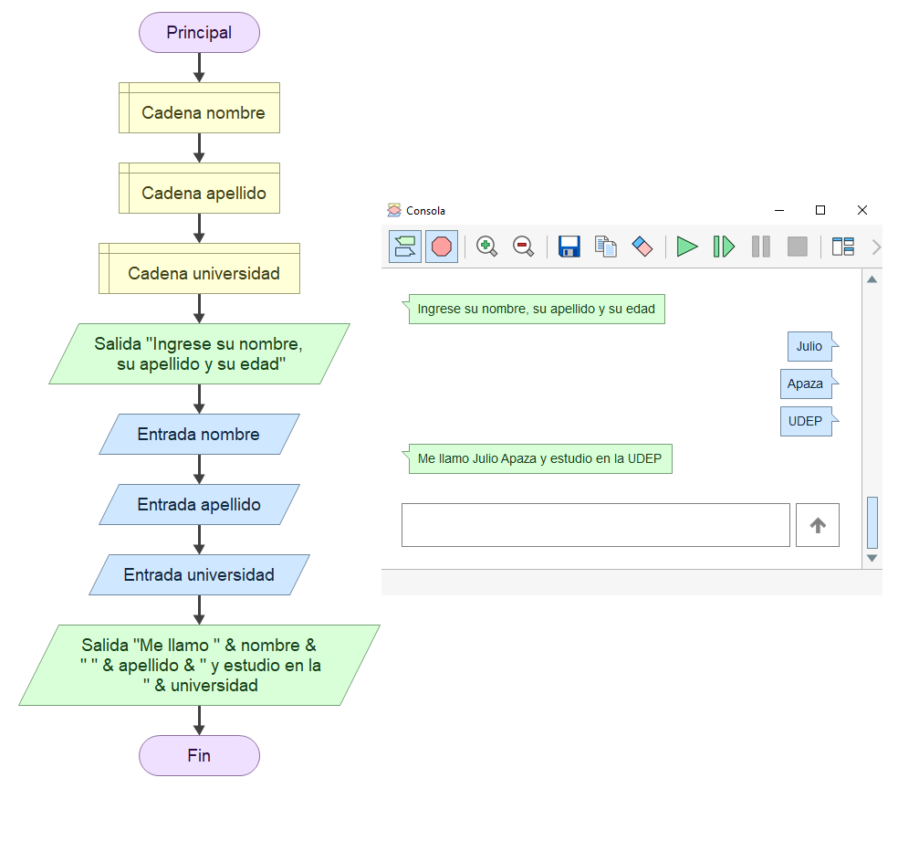
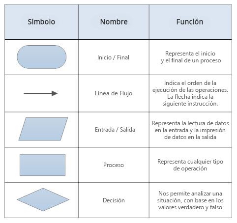
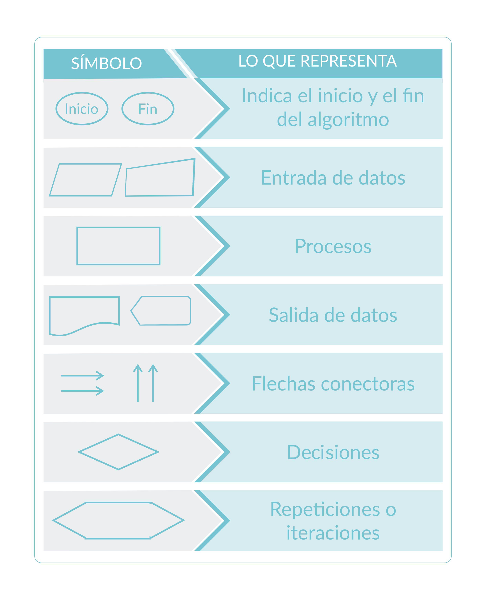
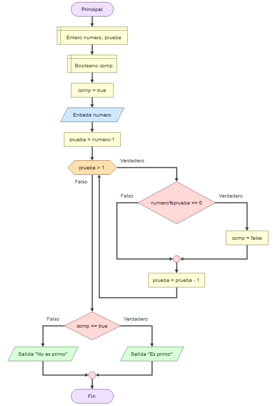

# Diagramas de flujo

Los diagramas de flujo sirven para representar gráficamente procesos o algoritmos, utilizando símbolos estándar para representar las distintas etapas, pasos, decisiones y procesos del macroproceso o algoritmo.

En el ejemplo mostrado se presenta un algoritmo que recibe tres entradas de tipo "string" y las junta para devolver una oración.

### Símbolos de diagramas de flujo

En las siguientes dos tablas se muestran algunos de los principales símbolos de diagramas de flujo con los que se puede representar una gran cantidad de algoritmos.

Nótese que la segunda tabla contiene símbolos que representan lo mismo que en la primera tabla pero con una apariencia ligeramente distinta.

	  

**Ejemplo de diagrama de flujo de algoritmo que comprueba si un número es primo**

### Importancia de aprender a usar diagramas de flujo

La habilidad de diseñar y crear diagramas de flujo es valiosa no solo en programación, sino en todas las ramas de la ingeniería. Para programadores e ingenieros de sistemas, representar un proceso de forma gráfica ayuda a evitar errores lógicos y facilita el diseño de algoritmos óptimos para diversas situaciones.

Aunque es poco probable que te contraten exclusivamente para dibujar diagramas de flujo, dominar esta herramienta te permitirá representar visualmente procesos complejos, cuya lógica puede ser difícil de comprender directamente. Esto se aplica no solo a procesos informáticos, sino también a producción, cadenas de suministro, y otros sistemas.