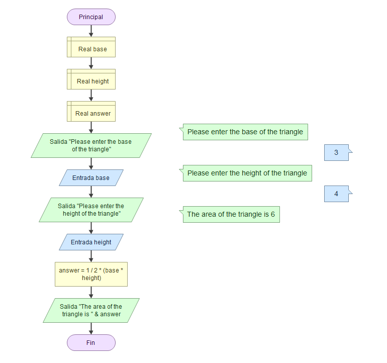

# Diagramas de flujo

Los diagramas de flujo sirven para representar gráficamente procesos o algoritmos, utilizando símbolos estándar para representar las distintas etapas, pasos, decisiones y procesos del macroproceso o algoritmo.

En el ejemplo mostrado se presenta un algoritmo que recibe tres entradas de tipo "string" y las junta para devolver una oración.
// Commit de prueba para comprobar si se carga la imágen